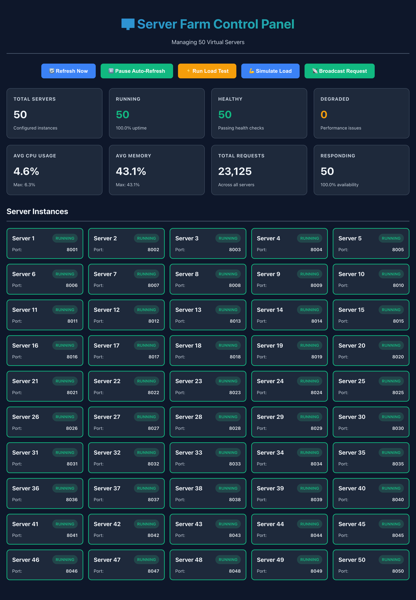

# 🖥️ Local Server Farm Simulator

> A production-grade local development environment that simulates **50 independent servers** using Docker containers, complete with real-time monitoring, load testing, and a beautiful web dashboard.


**Perfect for**: Testing scalability • Learning distributed systems • Load testing • Chaos engineering • DevOps practice

---

## 📋 Table of Contents
- [Quick Start](#-quick-start-5-minutes)
- [What You Get](#-what-you-get)
- [Architecture](#-architecture)
- [Usage Examples](#-usage-examples)
- [Configuration](#-configuration)
- [Troubleshooting](#-troubleshooting)
- [Advanced Topics](#-learn-more)

---

## 🚀 Quick Start (5 Minutes)

### Prerequisites
- Docker Desktop (running)
- Python 3.9+
- Node.js 18+
- 8GB+ RAM recommended

### Installation

```bash
# 1. Clone and navigate
cd /Users/prateekro/Documents/projects/ai

# 2. Generate docker-compose for 50 servers
python3 generate_compose.py 50 8000

# 3. Start all containers
docker-compose up -d --build

# 4. Install and start control plane (Terminal 1)
cd control-plane
pip3 install -r requirements.txt
python3 main.py

# 5. Install and start web interface (Terminal 2)
cd web-interface
npm install
npm run dev
```

### Access Points
- 🌐 **Web Dashboard**: http://localhost:3000
- 🎮 **Control API**: http://localhost:8000
- 📖 **API Docs**: http://localhost:8000/docs
- 🖥️ **Servers**: http://localhost:8001-8050

### 📸 Dashboard Preview


*Real-time monitoring dashboard showing all 50 servers, metrics, and control options*

### Quick Test
```bash
# Health check all servers
python3 tools/health_check.py

# Run load test
python3 tools/load_test.py --servers 10 --requests 100

# Test individual server
curl http://localhost:8001/health
```

---

## 🎁 What You Get

### Core Components
- **50 Docker Containers** - Isolated FastAPI servers with health checks, metrics, and configurable workloads
- **Control Plane API** - FastAPI backend for orchestration, monitoring, and load testing
- **Web Dashboard** - React interface with real-time metrics and beautiful visualizations
- **Testing Tools** - Load testing, health checks, and chaos engineering utilities
- **Complete Documentation** - 3,000+ lines covering everything from basics to advanced topics

### Key Features
✅ Real-time monitoring (CPU, memory, network)  
✅ Automated health checks every 30 seconds  
✅ Built-in load testing with configurable parameters  
✅ Container lifecycle management (start/stop/restart)  
✅ Broadcast commands to all servers  
✅ Chaos engineering support  
✅ Interactive API documentation (Swagger)  
✅ Resource limits per container  
✅ Auto-refresh dashboard  
✅ Extensible architecture

---

## 🏗️ Architecture

```
                    🌐 Web Dashboard (React)
                    http://localhost:3000
                    • Real-time monitoring
                    • Control interface
                            ↓
                    🎮 Control Plane API (FastAPI)
                    http://localhost:8000
                    • Container orchestration
                    • Metrics aggregation
                    • Load test execution
                            ↓
            🐳 Docker Compose Network
                    ↙ ↓ ↘
        🖥️ Server-1   Server-2 ... Server-50
        :8001        :8002       :8050
        • FastAPI app
        • Health checks
        • Metrics endpoint
        • Simulated workloads
```

**Tech Stack**: Docker • FastAPI • React • Vite • aiohttp • Uvicorn

---

## 💡 Usage Examples

### Basic Operations

```bash
# Start everything
docker-compose up -d

# Check status
docker-compose ps

# View logs
docker-compose logs -f server-1

# Stop everything
docker-compose down
```

### Testing & Monitoring

```bash
# Health check all 50 servers
python3 tools/health_check.py
# Output: ✅ 50/50 healthy (100.0%)

# Load test first 10 servers
python3 tools/load_test.py --servers 10 --requests 1000 --concurrency 20
# Output: 10,000 total requests, ~50ms avg latency

# Monitor resources
docker stats --no-stream | grep server
```

### API Usage

```bash
# Get all server status
curl http://localhost:8000/api/servers | jq

# Get aggregated metrics
curl http://localhost:8000/api/metrics | jq

# Run load test via API
curl -X POST http://localhost:8000/api/load-test \
  -H "Content-Type: application/json" \
  -d '{"target_servers": [1,2,3,4,5], "requests": 500}'

# Simulate CPU load on servers
curl -X POST http://localhost:8000/api/simulate-load \
  -H "Content-Type: application/json" \
  -d '{"server_ids": [1,2,3], "cpu_duration": 5.0, "memory_mb": 100}'
```

### Chaos Engineering

```bash
# Stop random servers
for i in {1..5}; do
  docker-compose stop server-$((RANDOM % 50 + 1))
done

# Check system resilience
python3 tools/health_check.py

# Restart all
docker-compose start
```

---

## ⚙️ Configuration

### Scaling Servers

```bash
# Generate compose file for different counts
python3 generate_compose.py 25 8000   # 25 servers
python3 generate_compose.py 100 8000  # 100 servers

# Apply changes
docker-compose up -d --build
```

### Resource Limits

Edit `docker-compose.yml`:
```yaml
deploy:
  resources:
    limits:
      cpus: '0.5'      # Adjust CPU limit
      memory: 256M     # Adjust memory limit
```

### Environment Variables

Create `.env` file:
```bash
CONTROL_PLANE_PORT=8000
SERVER_BASE_PORT=8001
SERVER_COUNT=50
LOG_LEVEL=INFO
```

---

## 🐛 Troubleshooting

### Docker not found
```bash
# Check if Docker Desktop is running
docker info

# Add Docker to PATH (macOS)
export PATH="/usr/local/bin:$PATH"

# Or start Docker Desktop
open /Applications/Docker.app
```

### Containers showing unhealthy
```bash
# Rebuild with fixed health check
docker-compose build
docker-compose up -d

# Wait for health checks to pass
sleep 30
docker-compose ps
```

### Port already in use
```bash
# Find what's using the port
lsof -i :8000-8050

# Use different port range
python3 generate_compose.py 50 9000
```

### High resource usage
```bash
# Reduce number of servers
python3 generate_compose.py 25 8000
docker-compose up -d

# Or increase Docker Desktop resources
# Docker Desktop → Settings → Resources
```

### Control plane can't connect to Docker
```bash
# Check Docker socket
ls -la /var/run/docker.sock

# Restart Docker Desktop
# The control plane will fall back to HTTP-only monitoring
```

---

## 📚 Learn More

### Documentation Files
- **[QUICKSTART.md](QUICKSTART.md)** - Detailed setup guide with troubleshooting
- **[COMMANDS.md](COMMANDS.md)** - Complete command reference and cheat sheet
- **[TESTING.md](TESTING.md)** - Comprehensive testing strategies and scenarios
- **[ADVANCED.md](ADVANCED.md)** - Production tips, chaos engineering, integrations
- **[DOCUMENTATION.md](DOCUMENTATION.md)** - Complete documentation index

### Use Cases
- 🎓 **Learning**: Understand Docker, distributed systems, API design
- 🧪 **Testing**: Load balancers, connection pools, microservices
- 🔍 **Development**: Build monitoring tools, practice DevOps
- 💥 **Chaos Engineering**: Test failure scenarios, recovery procedures
- 📊 **Benchmarking**: Measure performance, identify bottlenecks

### Key Endpoints

**Control Plane API** (`http://localhost:8000`)
- `GET /api/servers` - List all servers
- `GET /api/health` - Health check all servers
- `GET /api/metrics` - Aggregated metrics
- `POST /api/load-test` - Run load test
- `POST /api/broadcast` - Broadcast to all servers

**Individual Servers** (`http://localhost:8001-8050`)
- `GET /` - Server info
- `GET /health` - Health status
- `GET /metrics` - Detailed metrics
- `POST /simulate-load` - Trigger load simulation
- `GET /slow-endpoint` - Simulate slow response

---

## 🎯 Performance Benchmarks

**Expected Results** (MacBook Pro M1/M2):
- Startup: 30-60s (first build)
- Request Latency: <10ms average
- Throughput: 50,000+ req/s aggregate
- Memory: ~5-8GB total (50 servers)
- CPU: 10-20% idle, scales with load

**Scalability**:
- Minimum: 10 servers (4GB RAM)
- Recommended: 50 servers (8GB RAM)
- Maximum: 100+ servers (16GB+ RAM)

---

## 🤝 Contributing

Found a bug? Have an idea? Contributions welcome!

1. Fork the repository
2. Create a feature branch
3. Make your changes
4. Submit a pull request

---

## 📄 License

MIT License - Free to use for learning and testing

---

## 🙏 Acknowledgments

Built with modern, open-source technologies:
- **Docker** - Containerization platform
- **FastAPI** - Modern Python web framework
- **React** - UI library
- **Vite** - Build tool

---

## ⭐ Quick Reference

```bash
# Setup
python3 generate_compose.py 50 8000
docker-compose up -d --build

# Start services
cd control-plane && python3 main.py    # Terminal 1
cd web-interface && npm run dev        # Terminal 2

# Test
python3 tools/health_check.py
python3 tools/load_test.py

# Access
open http://localhost:3000   # Dashboard
open http://localhost:8000   # API

# Stop
docker-compose down
```

---

**Made with ❤️ for learning and testing distributed systems**
